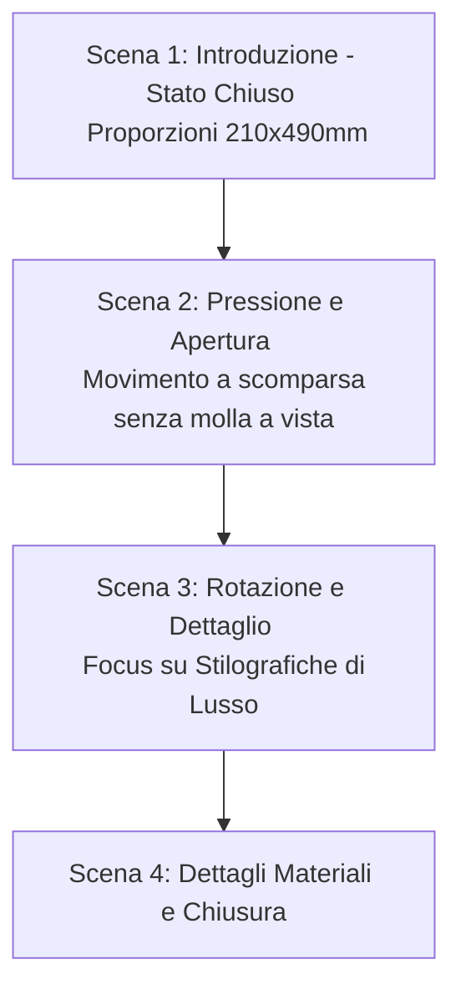

# Sceneggiatura e Prompt Video: Espositore per Stilografiche di Lusso

Questo documento contiene i dettagli di progettazione del video di presentazione dell'espositore, ottimizzati sulla base dei dati CAD reali e del tuo feedback. 

## Specifiche del Progetto (Dimensioni e Vincoli)
Per garantire che Google Omni mantenga le proporzioni corrette ed eviti di mostrare componenti interni errati come la molla a vista, abbiamo tradotto le quote CAD in riferimenti visivi specifici per l'AI:
*   **Diametro Esterno:** $210\text{ mm}$ (proporzione visiva slanciata ed elegante).
*   **Altezza Totale (Chiuso):** $490\text{ mm}$ (rapporto d'aspetto di circa 1:2.3 tra larghezza e altezza).
*   **Corsa di Apertura:** La colonna centrale si eleva verticalmente di circa $250\text{ mm}$.
*   **Meccanismo a Scomparsa:** La molla e i magneti al neodimio sono **completamente interni**. Non ci sono molle o ingranaggi a vista; il movimento deve apparire fluido, pulito e "magico".
*   **Contenuto:** Esclusivamente stilografiche di lusso (corpo laccato nero, finiture in oro, pennini lucidi). Niente sigari.

---

## 🎬 Storyboard & Voce Narrante (Durata: ~40 Secondi)

Questo schema suddivide il video in 4 scene logiche per consentire una generazione controllata clip-per-clip (consigliato per la massima fedeltà).



### Scena 1: Lo Stato Chiuso (0:00 - 0:10)
*   **Inquadratura:** Movimento di camera lento (orbitale) attorno all'espositore chiuso appoggiato su una scrivania presidenziale in legno massiccio scuro. La luce calda filtra da una finestra retrostante.
*   **Video Prompt (Omni):**
    > *English:* "A slow cinematic orbit shot of a closed luxury cylindrical pen display case on a dark oak executive desk. The object has a diameter of 210mm and a total height of 490mm, presenting a sleek 1:2.3 proportion. The outer shell is a pristine, high-clarity transparent methacrylate (PMMA) tube. Inside, a central column with matte anodized black aluminum cap and carbon fiber wrap is visible, with luxury fountain pens protected inside. Elegant natural sunbeams lighting up dust motes. No visible springs, clean minimalist design, photorealistic, 4k."
*   **Voce Narrante (ITA):**
    > *"Un connubio perfetto tra ingegneria di precisione e design d'alta gamma. Ecco la custodia definitiva per le vostre stilografiche più preziose."*

### Scena 2: L'Apertura "Push-to-Open" (0:10 - 0:20)
*   **Inquadratura:** Dettaglio a mezza altezza. Una mano preme leggermente il coperchio superiore. Il coperchio scende di pochi millimetri, si sblocca e la colonna centrale sale dolcemente di 250mm svelando le penne. La molla è invisibile, nascosta all'interno della colonna centrale in fibra di carbonio.
*   **Video Prompt (Omni):**
    > *English:* "Close-up shot of a hand gently pressing the top cap of the 210mm wide cylindrical display case. The mechanical lock releases, and the inner carbon-fiber carousel slowly and smoothly rises vertically by 250mm, revealing a collection of luxury fountain pens. The spring-loaded mechanism is completely internal and concealed; no springs, wires, or gears are visible. The motion is fluid and hydraulically dampened. Photorealistic, 8k, slow motion."
*   **Voce Narrante (ITA):**
    > *"Con una leggera pressione sul coperchio superiore, il sistema magnetico a scomparsa si sblocca, elevando silenziosamente il supporto interno per rivelare il suo contenuto."*

### Scena 3: La Rotazione della Colonna (0:20 - 0:30)
*   **Inquadratura:** Macro sui pennini in oro e sul corpo in lacca lucida delle penne. Il supporto interno ruota di 360° per permettere la scelta.
*   **Video Prompt (Omni):**
    > *English:* "Macro close-up shot of the open display. The inner carousel, wrapped in premium black carbon fiber, slowly rotates 360 degrees. The slots hold luxury fountain pens with polished black lacquer barrels and gleaming gold nibs. Soft lighting highlights the metallic details of the pens and the carbon weave. The central column remains solid and clean, hiding all mechanical springs. Cinematic depth of field, 60fps."
*   **Voce Narrante (ITA):**
    > *"La rotazione fluida della colonna in fibra di carbonio offre una vista a trecentosessanta gradi, permettendovi di selezionare la stilografica ideale per ogni vostra firma."*

### Scena 4: Finiture e Chiusura (0:30 - 0:40)
*   **Inquadratura:** Inquadratura leggermente dal basso. La mano spinge delicatamente verso il basso il coperchio, riportandolo in posizione chiusa all'interno del tubo protettivo. Dettaglio finale sulla targhetta metallica alla base.
*   **Video Prompt (Omni):**
    > *English:* "A hand pushes the top cap of the display case back down until it clicks and locks into its closed state of 490mm height. The camera pans down to focus on a polished stainless steel brand plate at the matte black aluminum base. Sun rays casting elegant shadows. Premium commercial aesthetic, slow fade to black, photorealistic, 4k."
*   **Voce Narrante (ITA):**
    > *"Alluminio anodizzato, fibra di carbonio e metacrilato purissimo. Protezione assoluta, estetica senza compromessi."*

---

## 🎛️ Master Prompt Unico (Per generazione in un solo passaggio)
Se preferisci generare l'intero video da un singolo prompt (utilizzando le tue tre immagini PNG/JPG convertite come riferimenti chiave):

```text
A 40-second high-end commercial for a luxury cylindrical fountain pen display case on a solid dark wood desk in a sunlit office, using images 'CHIUSO', 'APERTO', and 'ESTRUSO' as reference. The object has a diameter of 210mm and a closed height of 490mm (1:2.3 proportion). 

Sequence of events:
1. Starts on the closed state (image CHIUSO): showing the transparent methacrylate tube and black anodized aluminum base. No internal springs are visible.
2. A hand presses the top cap, releasing a hidden internal magnetic lock. The inner support rises vertically by 250mm in a smooth, dampened motion to the open state (image APERTO). The spring mechanism is completely concealed inside the solid carbon-fiber central column.
3. The open column slowly rotates 360 degrees to showcase luxury gold-trimmed fountain pens in their custom slots.
4. Transition to a clean technical view representing the exploded design (image ESTRUSO) where parts like the carbon column, transparent tube, neodymium magnets, rubber O-rings, and the hidden internal spring are shown separated in a clean space.

Strictly no visible springs in the assembled closed or open states. Macro lens, cinematic lighting, 4k resolution, hyper-realistic, 60fps.
```

---

## 🛠️ Istruzioni per l'uso in Google Omni:
1.  **Conversione File:** Assicurati di convertire le immagini in `.png` o `.jpg` prima di fare l'upload su Google Omni.
2.  **Impostazione Lunghezza Video:** Seleziona l'opzione per la massima durata consentita (solitamente 10-15 secondi per clip) e unisci le scene per comporre il video da 40 secondi.
3.  **Voice Over:** Puoi caricare la traccia audio con la voce narrante in italiano (registrata da te o tramite una text-to-speech AI) direttamente nel software di montaggio video o nella timeline di Google Vids/Omni sovrapponendola alle clip corrispondenti.
